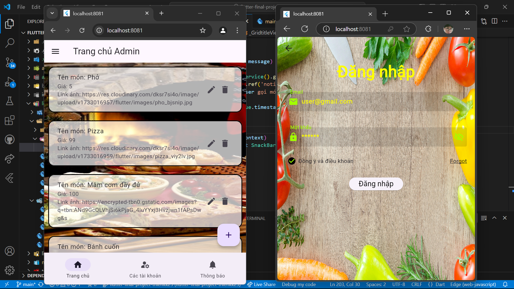
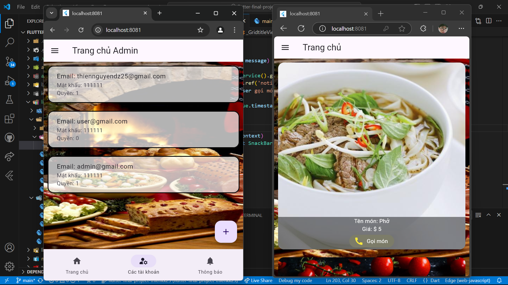
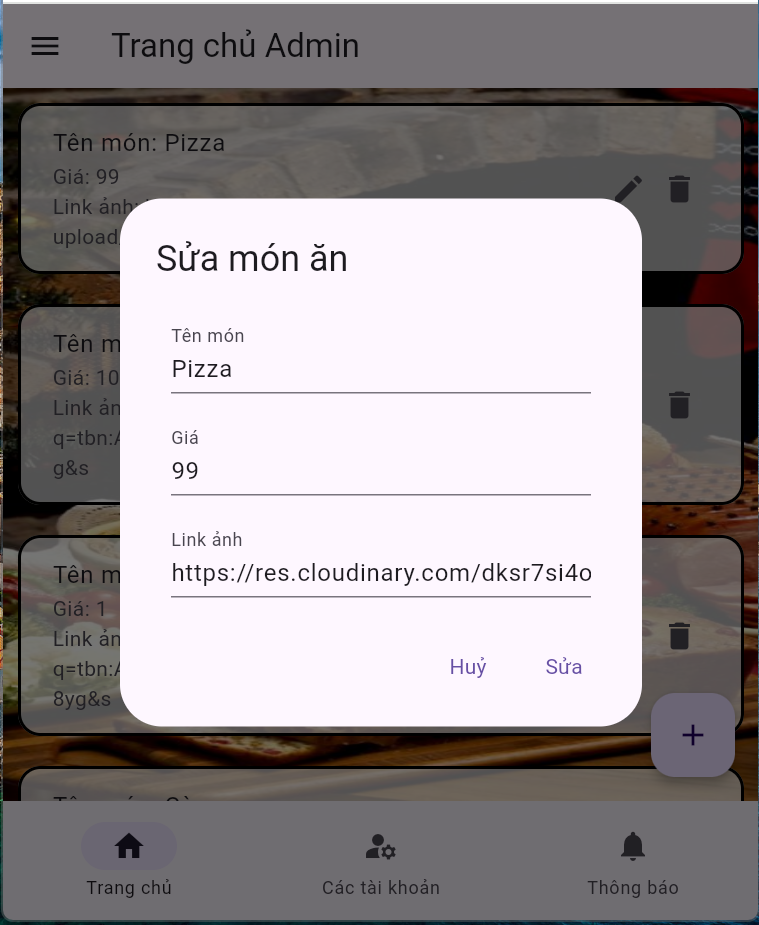

# Hướng dẫn

1. Tải mã nguồn từ repository:
    ```bash
    git clone https://github.com/thienkk25/app_oderFood_flutter.git
    ```
    - Chạy lệch terminal để đảm bảo mã nguồn, thư viện:
      ```bash
      flutter pub get
      ```
2. Cần chuẩn bị thiết lập dịch vụ Firebase vào dự án:

    - [Hướng dẫn setup Firebase](https://firebase.google.com/docs/flutter/setup?platform=android "Chi tiết tại đây")

3. Cài đặt thư viện cần thiết

  - **Cách 1**
    - Thêm các thư viện vào tệp pubspec.yaml (nếu chưa có):
      - firebase_core: ^3.8.0
      - firebase_auth: ^5.3.3
      - cloud_firestore: ^5.5.0
      - cached_network_image: ^3.4.1
    - Cài đặt thư viện:
      - ```bash
        flutter pub get
        ```

  - **Cách 2**
    - Thêm thư viện bằng lệch terminal (nếu chưa có):
      - ```bash
        flutter pub add firebase_core
        flutter pub add firebase_auth
        flutter pub add firebase_database
        flutter pub add cloud_firestore
        flutter pub add cached_network_image
        ```
    - Xong chạy lệnh:
      - ```bash
        flutter pub get
        ```

  - **Chú ý**
    - Trong file tệp pubspec.yaml thêm (nếu chưa có):
      ```yaml
        flutter:
          ...
          assets:
            - assets/images/
        ```

4. Chạy ứng dụng:
   ```bash
   flutter run
   ```
5. Kiểm tra ứng dụng trên thiết bị hoặc máy ảo.
6. Đăng nhập hoặc tạo tài khoản mới.
7. Thực hiện các thao tác CRUD và kiểm tra kết quả.
  - Quyền admin:
    - Thêm, sửa, xoá danh sách đồ ăn
    - Hiện thị các tài khoản người dùng và thêm.
    - Danh sách người dùng gọi món thời gian thực
  - Quyền người dùng:
    - Hiện thị danh sách đồ ăn có ảnh
    - Gọi món
8. Thực hiện kiểm thử tự động và xem kết quả:
    ```bash
    flutter test
    ```
9. Screenshots hoặc video demo về ứng dụng và quá trình kiểm thử tự động.
  - 

  - 

  - 

  - [Link video](https://res.cloudinary.com/dksr7si4o/video/upload/v1734433223/flutter/video_kq/KetQua_gfhnxs.mp4)

**Note:** Sản phẩm vẫn đang qua trình phát triển